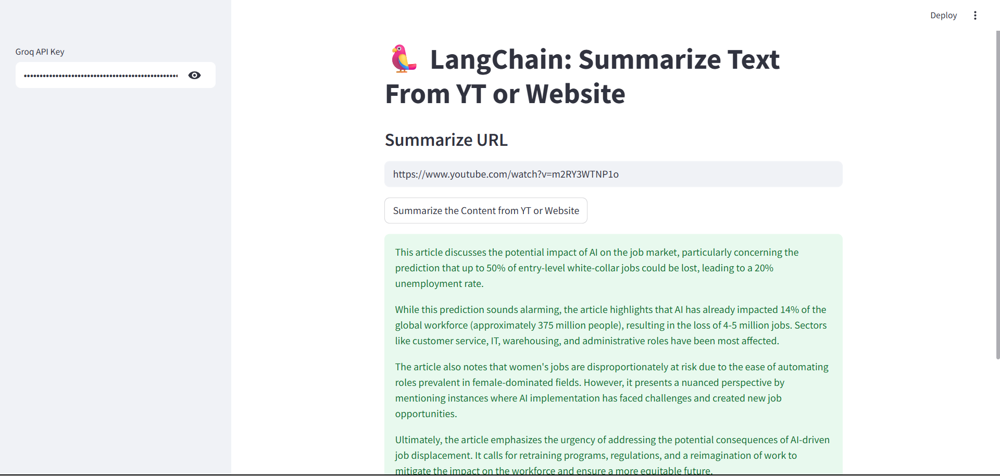
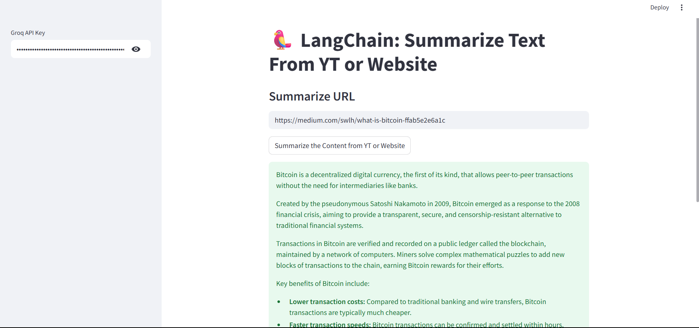

<p align="center">
  
</p>

# 🧠 AI-ContentSummarizer-Pro

[](https://www.python.org/)
[](LICENSE)
[](https://streamlit.io/)
[](https://github.com/langchain-ai/langchain)
[](https://console.groq.com)

> A Streamlit-based web app that summarizes content from YouTube videos and websites using LangChain with Groq's Gemma model.

## ✨ Features

- 🔗 Summarize content from **YouTube videos** or **Web URLs**
- 🧠 Powered by **LangChain** and **Groq's Gemma2-9b-it model**
- 📋 Two summarization strategies:
  - `stuff_summarizer.py` – quick, 300-word summary using `stuff` chain
  - `map_reduce_summarizer.py` – structured, detailed summary using `map_reduce` chain
- 🧵 Text processing for transcripts and webpages
- 📦 Lightweight and easy to deploy

---

## 🖼️ Screenshots

### 🎥 YouTube Summary 


### 🌐 Website Summary 


---

## 📁 File Structure

```bash
AI-ContentSummarizer-Pro/
├── stuff_summarizer.py # Basic summarizer using 'stuff' chain
├── map_reduce_summarizer.py # Advanced summarizer using 'map_reduce' chain
├── requirements.txt # Required Python packages
├── assets/
│ ├── banner.png
│ ├── yt_summary_screenshot.png
│ └── web_summary_screenshot.png
```

---

## 🔧 Installation

```bash
git clone https://github.com/yourusername/AI-ContentSummarizer-Pro.git
cd AI-ContentSummarizer-Pro
pip install -r requirements.txt
```

---

## 🛠️ Usage

```bash
# Run the basic summarizer
streamlit run stuff_summarizer.py

# OR run the advanced summarizer
streamlit run map_reduce_summarizer.py
```

Open your browser to the Streamlit app and input any **YouTube URL** or **website link**.

---

## 🔐 API Key

You will need a **Groq API Key**.
Grab one at: https://console.groq.com

Paste it in the sidebar input when the app launches.

---

## 💻 Tech Stack

- LangChain
- Groq API
- Streamlit
- YouTube Transcript API
- Unstructured URL Loader

---

## 💡 Use Cases

- Summarize lectures and podcasts
- Get digestible insights from news/blogs
- Quick research overviews

---

## 📄 License

This project is licensed under the MIT License.

---

## 🙌 Acknowledgments

Special thanks to LangChain, Groq, and Streamlit for powering this project.
